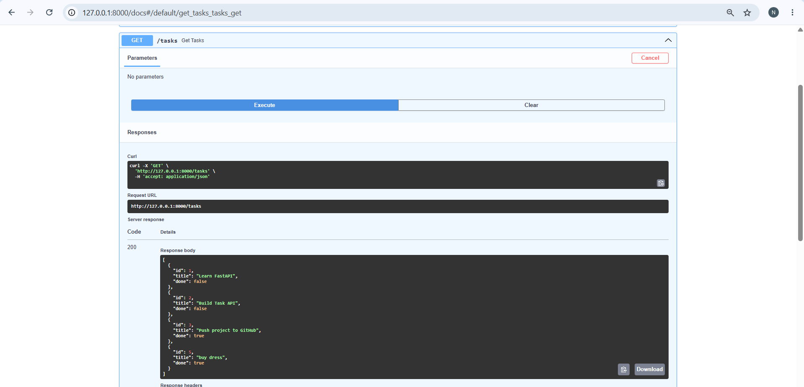
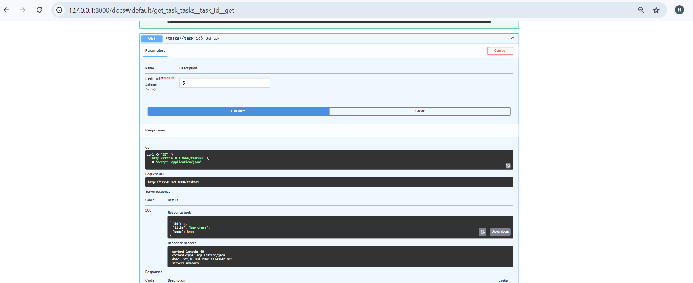
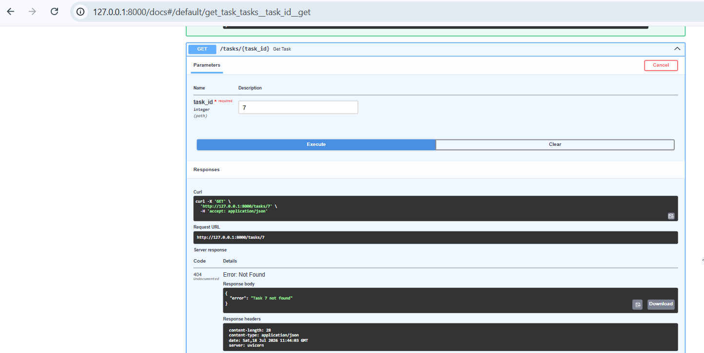
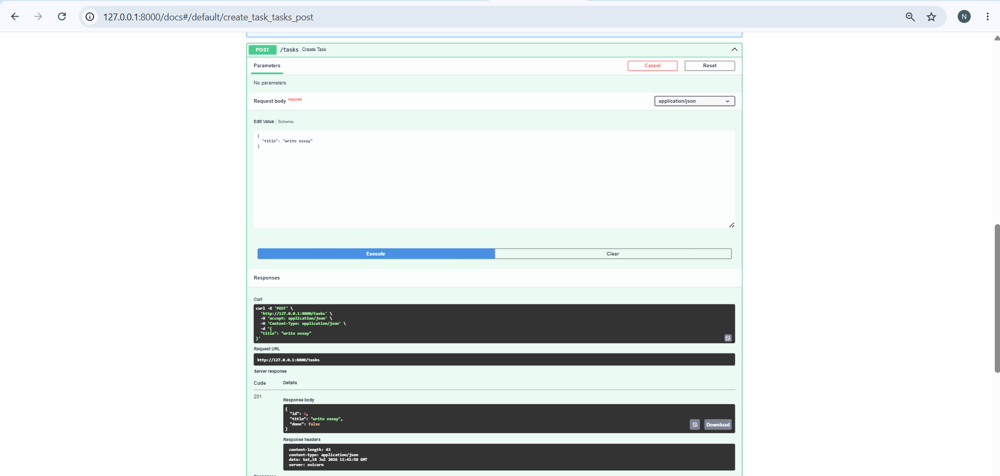
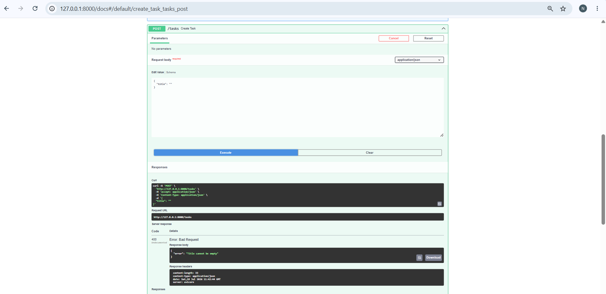
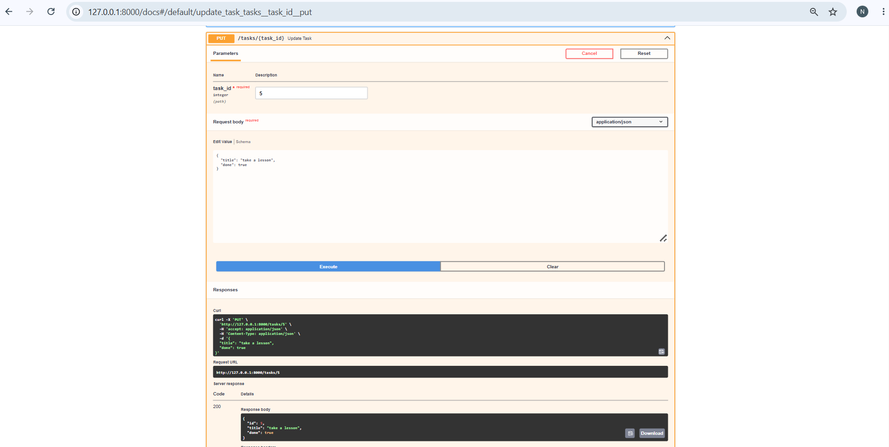
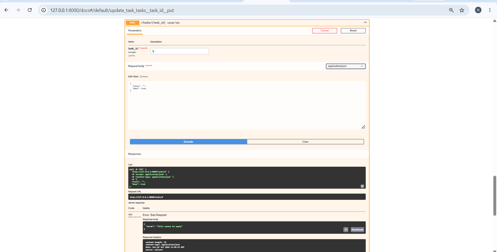
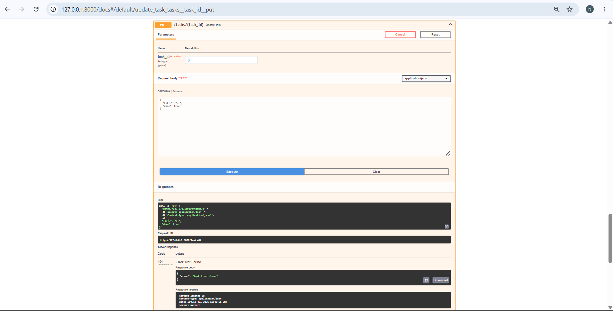
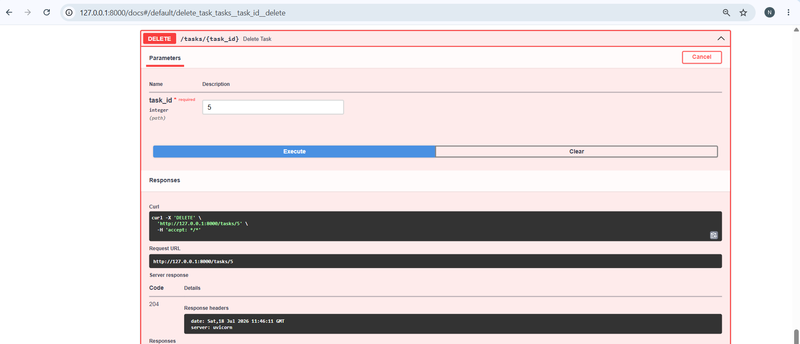
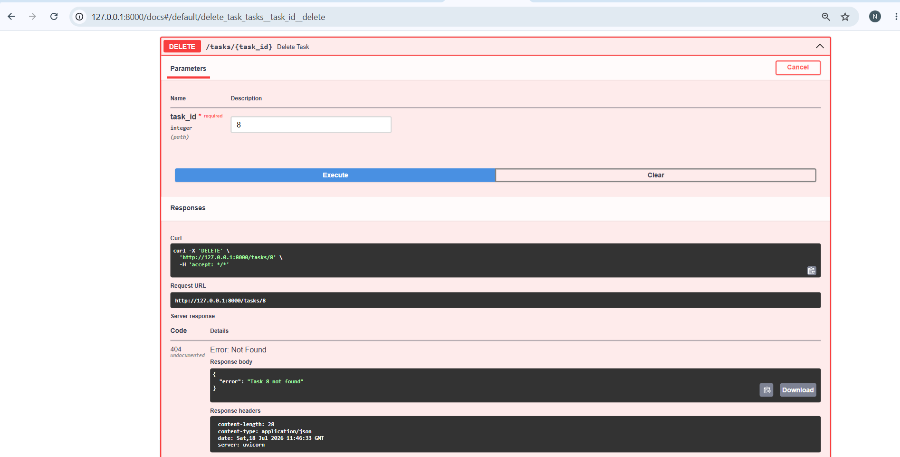

# Task API

A simple CRUD API built with FastAPI. The project manages tasks using in-memory storage (no database).

## Run the project

```bash
python -m uvicorn main:app --reload
```

Open the API:

* API: http://127.0.0.1:8000
* Swagger UI: http://127.0.0.1:8000/docs

## Endpoints

| Method | Endpoint         | Description                                                                                                                                 |
| ------ | ---------------- | ------------------------------------------------------------------------------------------------------------------------------------------- |
| GET    | /                | Returns API information including name, version and available endpoints.                                                                    |
| GET    | /health          | Checks whether the API is running and returns the server status.                                                                            |
| GET    | /tasks           | Returns the complete list of tasks.                                                                                                         |
| GET    | /tasks/{task_id} | Returns a single task by its ID. Returns **404** if the task does not exist.                                                                |
| POST   | /tasks           | Creates a new task. Assigns a new ID, sets **done = false**, and returns **201 Created**. Returns **400** if the title is missing or empty. |
| PUT    | /tasks/{task_id} | Updates a task's title and/or completion status. Returns **404** if the task is not found and **400** for invalid input.                    |
| DELETE | /tasks/{task_id} | Deletes a task and returns **204 No Content**. Returns **404** if the task does not exist.                                                  |

## Example curl

```bash
curl.exe -i http://127.0.0.1:8000/tasks
```

## Swagger UI Screenshots

### Get All Tasks



### Get Task by ID (Success)



### Get Task by ID (404 Error)



### Create Task (Success)



### Create Task (Validation Error)



### Update Task (Success)



### Update Task (Empty Title)



### Update Task (Unknown ID)



### Delete Task (Success)



### Delete Task (Unknown ID)


